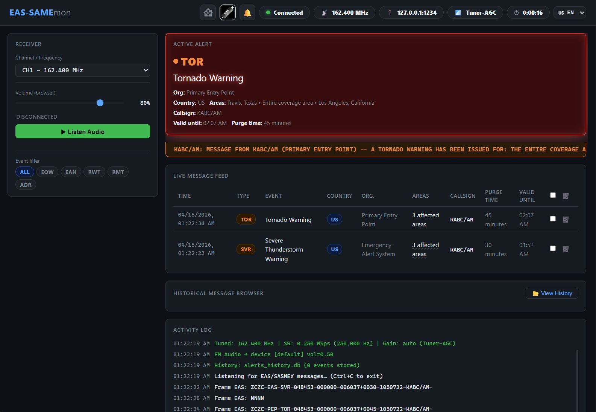
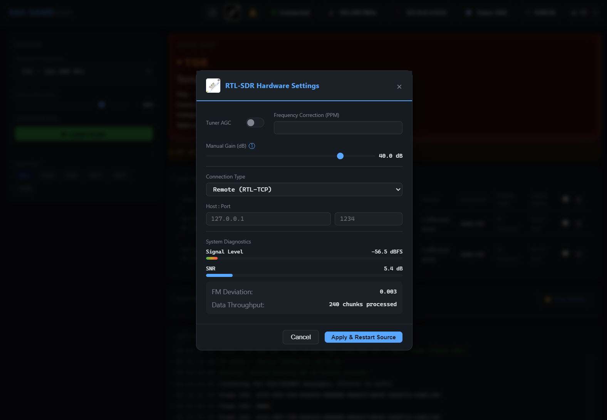
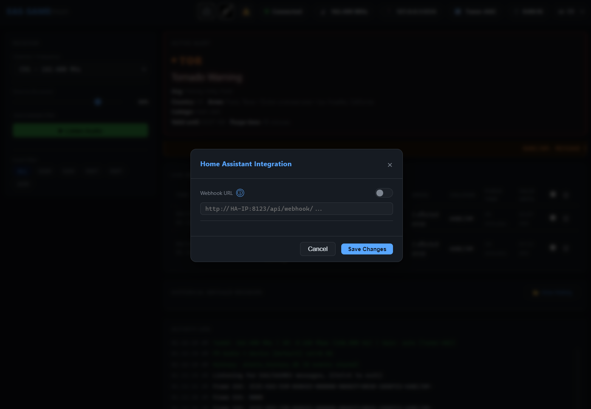

# EAS-SAMEmon

> [!WARNING]
> This is an **experimental project** intended for research and hobbyist use. It is not a replacement for official emergency alerting systems. See the [Legal Disclaimer](#%EF%B8%8F-legal-disclaimer) before use.

**EAS-SAMEmon** is an original project by **jhonjrd** with full native support for **North America** (US / CA / MX), including the **SASMEX** system (Mexican Seismic Alert System), and Home Assistant integration via Webhooks. The `alertparser` module is partially based on [dsame](https://github.com/cuppa-joe/dsame) by Joseph W. Metcalf, rewritten for multi-region support.

This project implements a 100% native Python real-time reception pipeline, eliminating the dependency on external tools like multimon-ng.

---

## ⚠️ Legal Disclaimer

> [!CAUTION]
> **EAS-SAMEmon is an experimental, hobbyist-grade project. It is NOT an official source of emergency alerts and must NOT be relied upon as the sole or primary means of receiving emergency warnings of any kind.**

This software is a **passive, receive-only** decoder for EAS/SAME signals broadcast over public radio frequencies. It is intended exclusively for educational, research, and hobbyist purposes. It does **not** transmit, retransmit, or rebroadcast any emergency alert, signal, or audio.

**In any emergency situation, always follow official instructions from authorized civil protection authorities.**

### What EAS-SAMEmon is NOT

- **Not an official alerting system** — This project has no affiliation with, nor is it endorsed or certified by, any government agency or official alerting authority.
- **Not a certified receiver** — This software has not been certified, tested, or approved by the FCC, FEMA, NOAA/NWS, CRTC, Pelmorex, CIRES, CENAPRED, SGIRPC-CDMX, or any other authority.
- **Not a substitute for official systems** — Do not use this tool to make life-safety decisions. Signal reception may be intermittent, delayed, or absent due to hardware limitations, RF interference, or software errors.
- **Not a retransmitter** — This software does not broadcast or rebroadcast EAS codes, Attention Signals, SASMEX audio tones, or any simulation thereof.

---

### Legal framework by country

#### 🇺🇸 United States

Passive reception and decoding of publicly broadcast EAS/SAME signals is lawful for private individuals. The FCC's Emergency Alert System rules (**47 CFR Part 11**) apply exclusively to licensed EAS Participants — broadcasters, cable operators, and satellite providers — not to private hobbyists or monitoring tools.

**Prohibition:** Unauthorized transmission of EAS codes or Attention Signals — or a simulation thereof — is strictly prohibited under **47 CFR § 11.45** and **47 U.S.C. § 325**, with civil penalties exceeding $25,000 per violation. This software is a passive-only tool and does not engage in any form of prohibited transmission.

*This project is not affiliated with the FCC, FEMA, NOAA, NWS, or IPAWS.*

#### 🇨🇦 Canada

Passive reception of publicly broadcast emergency alert signals is lawful under **Section 9(3) of the Radiocommunication Act (RSC 1985, c. R-2)**, which explicitly excludes broadcasting signals from the general prohibition on radio interception. Alert Ready / National Public Alerting System (NPAS) obligations under **CRTC Broadcasting Regulatory Policy 2014-444** apply to licensed broadcasters and distribution undertakings — not to private individuals or third-party software.

Note: This software does not access or redistribute data from the Pelmorex NAAD (National Alert Aggregation and Dissemination) system.

*This project is not affiliated with the CRTC, Pelmorex Corp., or the Alert Ready program.*

#### 🇲🇽 México

La recepción pasiva de señales de radiofrecuencia en bandas de uso público es legal conforme a la **Ley Federal de Telecomunicaciones y Radiodifusión**. El hecho de que la banda de 162.400-162.550 MHz esté declarada espectro protegido (DOF) prohíbe que terceros *transmitan* en esa banda, pero no impide su recepción.

**SASMEX® es marca registrada de CIRES, A.C.** Este proyecto no está afiliado, patrocinado ni autorizado por CIRES, CENAPRED, SGIRPC-CDMX ni ninguna dependencia gubernamental mexicana.

---

## Index

- [Screenshots](#screenshots)
1. [What this project does](#1-what-this-project-does)
2. [Module Map](#2-module-map)
3. [Real-time Pipeline Architecture](#3-real-time-pipeline-architecture)
4. [EAS Dynamic Simulator and Generator](#4-eas-dynamic-simulator-and-generator)
5. [Installation](#5-installation)
6. [Usage Scenarios](#6-usage-scenarios)
7. [Home Assistant Integration](#7-home-assistant-integration)
8. [SASMEX / EAS-SAME Protocol](#8-sasmex--eas-same-protocol)
9. [SASMEX Transmitters in CDMX](#9-sasmex-transmitters-in-cdmx)
10. [Technical Notes](#10-technical-notes)
11. [Credits](#11-credits)

---

## Screenshots

| Dashboard — Active Alert | RTL-SDR Settings | Home Assistant Webhook |
|:---:|:---:|:---:|
|  |  |  |

---

## 1. What this project does

EAS-SAMEmon has two main modes of operation:

| Mode | Input | Command |
|---|---|---|
| **Online (Real-Time)** | RTL-SDR (USB or remote) | `python pipeline.py --device 0 ...` |
| **Offline (File)** | Recorded WAV file | `python tools/decode_audio.py file.wav` |

In both cases, the result is the same: full decoding of the EAS/SAME message with English terminology for the entire North American region, transmitter identification, and optional JSON output.

### Key Differences
- **Native Demodulation**: Custom Python + NumPy implementation of quadrature IQ correlation algorithms (based on the EAS standard).
- **Multi-Region Support**: Automatic country detection based on callsigns (W/K/C) and area codes.
- **SASMEX Focus**: Recognition of the 5 transmitters in Mexico City and critical events like `EQW` (Seismic Alert).

---

## 2. Module Map

```
EAS-SAMEmon (Root)/
│
├── pipeline.py          ← Main entry point (real-time)
│
├── scripts/             ← Core Components
│   ├── alertparser.py   ← EAS/SAME Parser (Business Logic)
│   ├── eas_demod.py     ← Physical EAS Demodulator (AFSK)
│   ├── fm_demod.py      ← Narrowband FM Demodulator (IQ → PCM)
│   ├── local_source.py  ← Local USB Interface (pyrtlsdr)
│   ├── rtl_source.py    ← RTL-TCP Client (Network SDR)
│   ├── web_dashboard.py ← FastAPI + WebSocket Server
│   ├── mx_defs.py       ← Mexico Definitions (SASMEX)
│   ├── us_defs.py       ← USA Definitions (FIPS)
│   └── ca_defs.py       ← Canada Definitions (CLC)
│
├── tools/               ← Utilities
│   └── decode_audio.py  ← WAV file decoder (Native)
│
└── static/
    └── index.html       ← Web Dashboard (Premium UI)
```

---

## 3. Real-time Architecture

The system uses a multi-threaded pipeline to ensure no critical audio samples are lost:
1. **Source Thread**: Captures raw IQ samples from the RTL-SDR dongle.
2. **DSP Thread**: Demodulates the FM signal and passes the audio to the EAS correlation engine.
3. **App Thread**: Decodes the SAME text, stores it in SQLite, and distributes it via WebSockets to the Dashboard.

---

## 5. Installation

### Requirements (Debian/Ubuntu/Orange Pi)
```bash
sudo apt update
sudo apt install -y python3-venv python3-pip rtl-sdr libportaudio2

# Allow non-root USB access
sudo usermod -aG plugdev $USER
sudo udevadm control --reload-rules && sudo udevadm trigger
```

> **Note:** Log out and back in after `usermod` for the group change to take effect.

### Environment Setup
```bash
python3 -m venv venv
source venv/bin/activate
pip install -r requirements.txt
```

---

## 6. Usage Scenarios

EAS/SAME signals are broadcast across **7 channels**, each covering a different geographic area. Since each region uses a specific frequency, use `--channel` to select the one that corresponds to your receiver's location:

| Channel | Frequency |
|---------|-----------|
| 1 | 162.400 MHz |
| 2 | 162.425 MHz |
| 3 | 162.450 MHz |
| 4 | 162.475 MHz |
| 5 | 162.500 MHz |
| 6 | 162.525 MHz |
| 7 | 162.550 MHz |

### Decode a WAV file
```bash
python tools/decode_audio.py recording.wav
```

### Start monitoring — local USB RTL-SDR
```bash
# Channel 3 (162.450 MHz) — local device index 0
python pipeline.py --device 0 --channel 3 --gain 40

# Channel 1 (162.400 MHz) — with tuner AGC and audio playback
python pipeline.py --device 0 --channel 1 --tuner-agc --audio
```

### Multi-dongle setup — selecting by EEPROM serial number

When multiple RTL-SDR dongles are connected, USB enumeration order may change after a reboot, making `--device 0` unreliable. Use `--serial` to target a specific dongle by its EEPROM serial number instead.

**Step 1 — List connected dongles and find their serials:**
```bash
python pipeline.py --list-devices-usb
# Example output:
#   [0] Generic RTL2832U OEM  serial=00000001
#   [1] RTL-SDR Blog V4       serial=DONGLE01
```

**Step 2 — (Optional) Write a custom serial to the dongle's EEPROM:**
```bash
# Install rtl-sdr tools if not already present
sudo apt install rtl-sdr         # Debian/Ubuntu

# Write a descriptive serial to dongle at index 0 (e.g. "DONGLE01")
rtl_eeprom -d 0 -s DONGLE01
# Unplug and replug the dongle for the change to take effect
```

**Step 3 — Start monitoring by serial:**
```bash
python pipeline.py --serial DONGLE01 --channel 3 --gain 40
```

The `--serial` option is mutually exclusive with `--device` and `--host`.

### Start monitoring — remote RTL-TCP
```bash
# Channel 3 via network SDR
python pipeline.py --host 192.168.1.10 --channel 3 --gain 35

# Filter only seismic alerts (EQW)
python pipeline.py --host 192.168.1.10 --channel 3 --event EQW
```

### Web Dashboard
When starting `pipeline.py`, the dashboard will be available at `http://localhost:8080`. You can control the frequency, gain, and squelch on-the-fly from the browser.

---

---

## 7. Home Assistant Integration

EAS-SAMEmon can push decoded EAS/SASMEX alerts to Home Assistant in real time via **Webhooks**, configured from the web dashboard (click the Home Assistant icon in the top bar).

---

### Webhook Integration

Webhooks are the simplest option and work out of the box with Home Assistant running in Docker — no broker needed.

#### Step 1 — Create the automation in Home Assistant

1. Go to **Settings → Automations → Create automation → Create from scratch**
2. Click **Add trigger** → select **Webhook**
3. Set the **Webhook ID** to exactly: `eassamemon_alert`
4. Save the automation (actions configured in Step 3)

#### Step 2 — Configure EAS-SAMEmon

1. Open the EAS-SAMEmon web dashboard
2. Click the **Home Assistant** icon in the top bar
3. Enable the **Webhook URL** toggle
4. Paste your HA webhook URL — format depends on your setup:

| Setup | URL format |
|---|---|
| Local network | `http://192.168.1.X:8123/api/webhook/eassamemon_alert` |
| External domain | `https://your-ha-domain.com/api/webhook/eassamemon_alert` |

5. Click **Save Changes** — a green confirmation message will appear

#### Step 3 — Add a notification action

In the automation created in Step 1, add an action. Switch to YAML mode (`< >` icon) and paste:

```yaml
service: notify.mobile_app_YOUR_DEVICE
data:
  title: >
    ⚠️ {{ trigger.json.event_es }} ({{ trigger.json.EEE }})
  message: >
    📡 {{ trigger.json.transmitter.name }} ({{ trigger.json.LLLLLLLL }})
    
    🏙️ Toda el área de cobertura SASMEX
    
    🏙️ {{ trigger.json.areas_decoded | map(attribute='place') | join(', ') }}
    
    🕐 Válido hasta: {{ trigger.json.end }}
    ⏱️ Duración: {{ trigger.json.length }}
```

Replace `YOUR_DEVICE` with the name of your device. You can find it under **Settings → Apps → Companion App → Device name**, or by searching for `notify.mobile_app_` in the service picker — it will match the name of your phone (e.g. `notify.mobile_app_sm_s928b`).

#### Verifying the integration

After saving, every decoded alert will trigger the automation. To review past executions:

**Settings → Automations** → find your automation → **⋮ → Traces**

Each trace shows the full trigger payload under **Trigger variables**, including all decoded fields.

---

### JSON payload reference

The Webhook delivers a JSON object on every decoded alert. The structure is the same regardless of country; only the values and the `transmitter` field vary.

#### United States (US)

```json
{
  "ORG":             "WXR",
  "EEE":             "RWT",
  "TTTT":            "0100",
  "JJJHHMM":         "1051700",
  "LLLLLLLL":        "KEC83000",
  "COUNTRY":         "US",
  "event":           "Required Weekly Test",
  "event_es":        "Prueba Semanal Requerida",
  "organization":    "National Weather Service",
  "organization_es": "Servicio Nacional de Meteorología",
  "start":           "11:00 AM",
  "end":             "11:01 AM",
  "start_dt":        "2026-04-15T17:00:00+00:00",
  "end_dt":          "2026-04-15T17:01:00+00:00",
  "length":          "1 minute",
  "seconds":         60,
  "PSSCCC_list":     ["008031", "008005", "008059", "008001"],
  "areas_decoded": [
    {"code": "008031", "place": "Denver",    "state": "Colorado"},
    {"code": "008005", "place": "Arapahoe", "state": "Colorado"},
    {"code": "008059", "place": "Jefferson", "state": "Colorado"},
    {"code": "008001", "place": "Adams",     "state": "Colorado"}
  ],
  "transmitter":  {},
  "received_at":  "2026-04-15T17:00:08.412300+00:00"
}
```

#### Mexico (MX)

```json
{
  "ORG":             "CTV",
  "EEE":             "RWT",
  "TTTT":            "0300",
  "JJJHHMM":         "1041518",
  "LLLLLLLL":        "XMEX/037",
  "COUNTRY":         "MX",
  "event":           "Required Weekly Test",
  "event_es":        "Prueba Semanal Requerida",
  "organization":    "Civil Authority",
  "organization_es": "Autoridad Civil",
  "start":           "09:18 AM",
  "end":             "12:18 PM",
  "start_dt":        "2026-04-14T09:18:00+00:00",
  "end_dt":          "2026-04-14T12:18:00+00:00",
  "length":          "3 hours",
  "seconds":         10800,
  "PSSCCC_list": ["009009", "009000", "009004", "009005"],
  "areas_decoded": [
    {"code": "009009", "place": "Milpa Alta",            "state": "Ciudad de México"},
    {"code": "009000", "place": "complete",              "state": "Ciudad de México"},
    {"code": "009004", "place": "Cuajimalpa de Morelos", "state": "Ciudad de México"},
    {"code": "009005", "place": "Gustavo A. Madero",     "state": "Ciudad de México"}
  ],
  "transmitter": {
    "name":      "Las Palmas",
    "freq_mhz":  162.525,
    "entidad":   "EDOMEX",
    "municipio": "Huixquilucan"
  },
  "received_at": "2026-04-14T09:18:39.725751+00:00"
}
```

> **Note:** `areas_decoded[].place = "complete"` combined with `code = "000000"` indicates the alert covers the entire coverage area. Use the template condition shown in Step 3 to handle this case in your notification.

#### Event codes (`EEE`)

**National / Tests**

| Code | Event |
|------|-------|
| `EAN` | Emergency Action Notification |
| `EAT` | Emergency Action Termination |
| `NIC` | National Information Center |
| `NPT` | National Periodic Test |
| `RMT` | Required Monthly Test |
| `RWT` | Required Weekly Test |
| `DMO` | Practice/Demo Warning |
| `ADR` | Administrative Message |

**Seismic**

| Code | Event |
|------|-------|
| `EQW` | Seismic Alert |

**Civil Emergencies / Safety**

| Code | Event |
|------|-------|
| `AVA` | Avalanche Watch |
| `AVW` | Avalanche Warning |
| `BLU` | Blue Alert |
| `CAE` | Child Abduction Emergency (AMBER Alert) |
| `CDW` | Civil Danger Warning |
| `CEM` | Civil Emergency Message |
| `EVI` | Evacuation Immediate |
| `FRW` | Fire Warning |
| `HMW` | Hazardous Materials Warning |
| `LAE` | Local Area Emergency |
| `LEW` | Law Enforcement Warning |
| `NUW` | Nuclear Power Plant Warning |
| `RHW` | Radiological Hazard Warning |
| `SPW` | Shelter in Place Warning |
| `TOE` | 911 Telephone Outage Emergency |
| `VOW` | Volcano Warning |

**Biological and Health Hazards**

| Code | Event |
|------|-------|
| `BHW` | Biological Hazard Warning |
| `BWW` | Boil Water Warning |
| `FCW` | Food Contamination Warning |
| `IFW` | Industrial Fire Warning |

**Severe Weather — Watches**

| Code | Event |
|------|-------|
| `BZA` | Blizzard Watch |
| `CFA` | Coastal Flood Watch |
| `DSA` | Dust Storm Watch |
| `EQA` | Earthquake Watch |
| `EVA` | Evacuation Watch |
| `EXA` | Extreme Wind Watch |
| `FFA` | Flash Flood Watch |
| `FLA` | Flood Watch |
| `HTA` | Hurricane Force Wind Watch |
| `HUA` | Hurricane Watch |
| `HWA` | High Wind Watch |
| `SVA` | Severe Thunderstorm Watch |
| `TOA` | Tornado Watch |
| `TRA` | Tropical Storm Watch |
| `TSA` | Tsunami Watch |
| `WFA` | Wildfire Watch |
| `WSA` | Winter Storm Watch |

**Severe Weather — Warnings**

| Code | Event |
|------|-------|
| `BZW` | Blizzard Warning |
| `CFW` | Coastal Flood Warning |
| `DSW` | Dust Storm Warning |
| `EWW` | Extreme Wind Warning |
| `FFW` | Flash Flood Warning |
| `FLW` | Flood Warning |
| `FSW` | Flash Freeze Warning |
| `FGW` | Dense Fog Warning |
| `HTW` | Hurricane Force Wind Warning |
| `HUW` | Hurricane Warning |
| `HWW` | High Wind Warning |
| `IBW` | Iceberg Warning |
| `LSW` | Land Slide Warning |
| `MAW` | Marine Warning |
| `SMW` | Special Marine Warning |
| `SQW` | Snow Squall Warning |
| `SSA` | Storm Surge Watch |
| `SSW` | Storm Surge Warning |
| `SVR` | Severe Thunderstorm Warning |
| `TOR` | Tornado Warning |
| `TRW` | Tropical Storm Warning |
| `TSW` | Tsunami Warning |
| `WFW` | Wildfire Warning |
| `WSW` | Winter Storm Warning |

**Bulletins and Statements**

| Code | Event |
|------|-------|
| `FFS` | Flash Flood Statement |
| `FLS` | Flood Statement |
| `FLY` | Flood Advisory |
| `HLS` | Hurricane Local Statement |
| `HWY` | High Wind Advisory |
| `MWS` | Marine Weather Statement |
| `NOW` | Short Term Forecast |
| `POS` | Power Outage Statement |
| `SPS` | Special Weather Statement |
| `SVS` | Severe Weather Statement |

---

### Automation examples

> Replace `notify.mobile_app_YOUR_DEVICE_ID` with your own Home Assistant mobile app notify service (e.g. `notify.mobile_app_pixel_8` or `notify.mobile_app_iphone_john`). Find yours under **Settings → Devices & Services → Companion App**.

#### Notify on any alert

```yaml
trigger:
  - platform: webhook
    webhook_id: eassamemon_alert
action:
  - service: notify.mobile_app_YOUR_DEVICE_ID
    data:
      title: >
        ⚠️ {{ trigger.json.event }} ({{ trigger.json.EEE }})
      message: >
        📡 {{ trigger.json.LLLLLLLL }}
        
        🏙️ Entire coverage area
        
        🏙️ {{ trigger.json.areas_decoded | map(attribute='place') | join(', ') }}
        
        🕐 Valid until: {{ trigger.json.end }}
        ⏱️ Duration: {{ trigger.json.length }}
```

#### Notify only on tornado warnings (TOR)

Use a condition to filter by event type. The automation still triggers on every webhook, but the action only runs when the event code matches.

```yaml
trigger:
  - platform: webhook
    webhook_id: eassamemon_alert
condition:
  - condition: template
    value_template: "{{ trigger.json.EEE == 'TOR' }}"
action:
  - service: notify.mobile_app_YOUR_DEVICE_ID
    data:
      title: "🌪️ Tornado Warning"
      message: >
        📡 {{ trigger.json.LLLLLLLL }}
        
        🏙️ Entire coverage area
        
        🏙️ {{ trigger.json.areas_decoded | map(attribute='place') | join(', ') }}
        
        🕐 Valid until: {{ trigger.json.end }}
```

Replace `TOR` with any event code from the table above to filter for a different alert type.

---

## 8. SASMEX / EAS-SAME Protocol

- **EAS-SAMEmon**: Developed and refactored by **jhonjrd**.
- **alertparser module**: Based on [dsame](https://github.com/cuppa-joe/dsame) by Joseph W. Metcalf, significantly extended and rewritten for North American multi-region support.
- **DSP Layer**: Demodulation algorithms adapted for native Python.
- **SASMEX**: Information based on official protocols in Mexico.
